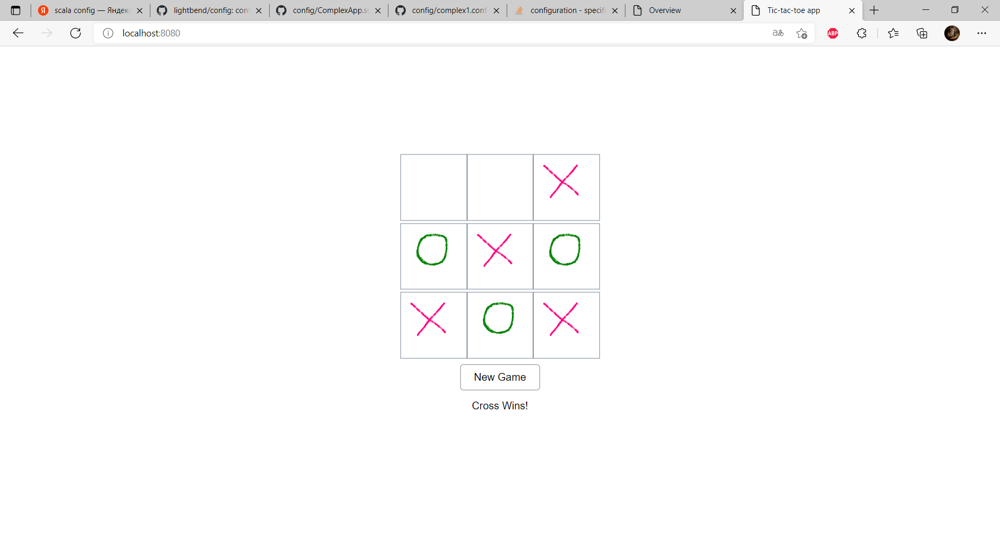

<h1>Tic-tac-toe</h1>

запускать sbt run, тесты sbt test

в этой ветке на текущий момент проект разделён на два приложения

- игра tic-tac-toe
- чат на вебсокетах

в heroku пока что крутится старая версия проекта, когда я не делил на несколько приложений, хочу еще сделать это все в докере, ибо там появился постгрес, который я использую для запоминания в бд игр с результатом

плюс было бы норм немного уменьшить класс ws.api.services.ChatService

https://peaceful-depths-92861.herokuapp.com - старая мастер версия

скрин фронта:

